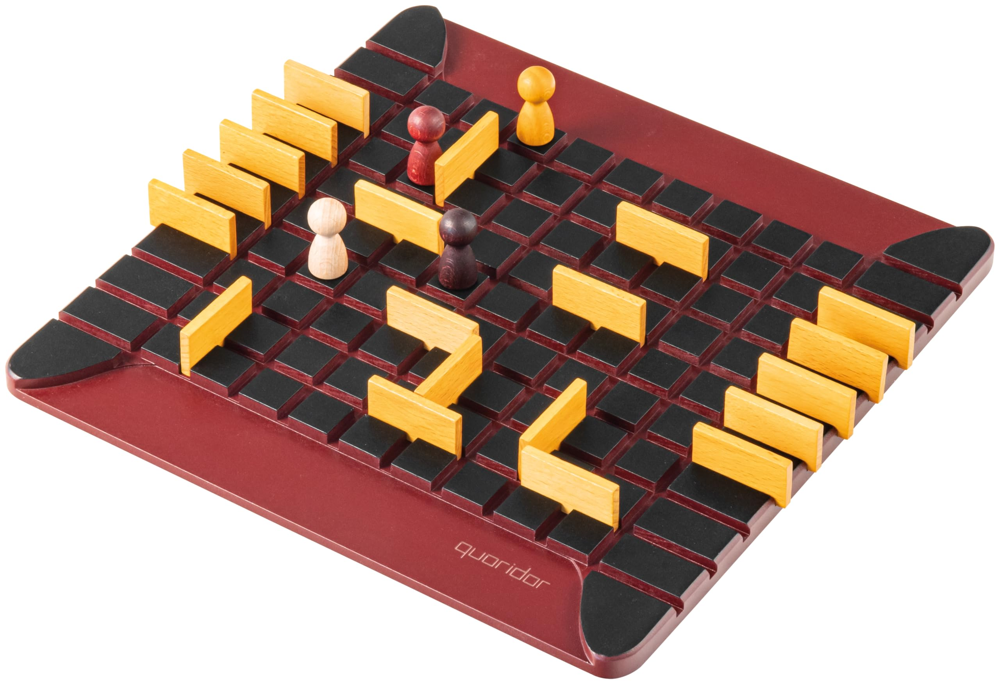

# Projet-IA : Jeu Quoridor

## Image du jeu Quoridor :


## Comment exécuter le jeu

### Prérequis
- Python 3.6 ou supérieur

### Installation
Aucune installation de dépendance n'est nécessaire. Le jeu utilise uniquement des bibliothèques standards de Python.

### Exécution du jeu
Pour lancer le jeu, exécutez simplement le fichier `Quoridor.py` :

```bash
python Quoridor.py
```

### Comment jouer

1. Au lancement du jeu, choisissez un mode de jeu :
   - 1 : Humain contre Humain
   - 2 : Humain contre IA
   - 3 : IA contre IA

2. Si vous choisissez un mode avec IA, sélectionnez le niveau de difficulté :
   - 1 : Facile
   - 2 : Moyen
   - 3 : Difficile

3. À chaque tour, vous avez trois options :
   - `d` : Déplacer votre pion
     - Choisissez ensuite la direction avec `h` (haut), `b` (bas), `g` (gauche), `d` (droite)
   - `m` : Placer un mur
     - Entrez les coordonnées `x` et `y` (nombres impairs)
     - Choisissez l'orientation avec `h` (horizontal) ou `v` (vertical)
   - `q` : Quitter la partie

4. Le plateau de jeu est affiché avec les coordonnées. Les joueurs sont représentés par "1" et "2", les cases vides par "o" et les murs par "█".

5. Le premier joueur qui atteint la ligne opposée à sa ligne de départ gagne la partie.

## Présentation du jeu Quoridor :

### Élément du jeu :

    - Nombre de joueurs : 2.
    - Plateau de 81 cases ( 9 x 9 ).
    - 20 barrières.

### Règles du jeux :

- ### But :

    Atteindre le premier la ligne opposée à sa ligne de départ.
        Le problème : votre adversaire pose des barrières pour vous ralentir !
        Rassurez-vous : il doit vous laisser au moins un passage libre. Mais qui aura le chemin le plus court ?

- ### Comment :

    Les joueurs se partagent les barrières et chacun pose son pion au centre de sa ligne de départ. A tour de rôle, chacun déplace son pion d'une case, ou pose une barrière afin de ralentir l'adversaire. Les pions doivent contourner les barrières, qui créent un labyrinthe dont il faut sortir très vite !

- ### Début d'une partie :

    Chaque joueur pose son pion au centre de sa ligne de départ (la première devant lui). Les 2 joueurs se font face. Un tirage au sort détermine qui commence.
    Chaque joueur possède 10 barrières.

- ### Déplacement des pions :

    Les pions se déplacent d’une seule case, horizontalement ou verticalement, en avant ou en arrière, mais jamais en diagonale. Les barrières doivent être contournées et non sautées.

- ### Face à face :

    Quand les 2 pions se retrouvent en vis-à-vis sur 2 cases voisines non séparées par une barrière, le joueur dont c’est le tour peut sauter son adversaire. Si une barrière est située derrière le pion sauté, alors le pion sauteur devra être posé sur n'importe quelle autre case adjacente au pion sauté.

- ### Pose des barrières :

    - Les barrières doivent être posées exactement entre 2 blocs de 2 cases. Elles ne peuvent pas se chevaucher. Une fois posées, elles ne peuvent plus être retirées ni bougées de la partie.

    - La pose des barrières a pour but de se créer son propre chemin ou de ralentir l’adversaire, mais il est interdit de lui fermer totalement l’accès à sa ligne d'arrivée : il faut toujours lui laisser une solution.

    - Lorsqu’un joueur n’a plus de barrières, il est obligé de déplacer son pion.

- ### Fin de la partie :

    Le premier joueur qui atteint une des 9 cases de la ligne opposée à sa ligne de départ gagne la partie.

### Présentation en vidéo du jeu Quoridor:

[Regarder la vidéo sur YouTube](https://youtu.be/cwsZZGmiFQM)